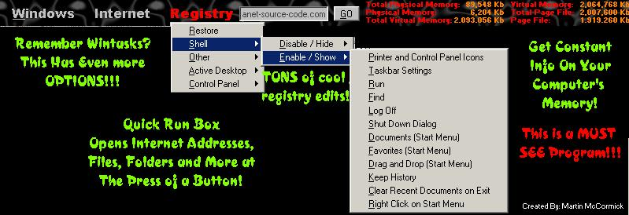



## CONTROL WINDOWS WITH TONS OF API AND TAKE ADVANTAGE OF THE COOL THINGS YOU CAN DO WITH THE REGISTRY\!

### Description

This does everything my previous submition of Wintasks does and much much more!!! It can do VERY cool things with the windows registry like enabling / showing and disabling / hiding the following things: Printer and control panel icons, windows taskbar settings, run and find in the start menu, the log off button and the shutdown button on the start menu, documents, favorites, and drag drop on the start menu, Internet Explore (IE) history, right clicking on the task bar, and saving settings about the desktop on exit! Also, AGENT (The name of this program) can hide and show the Network Neiborhood icon, and disable or enable the windows hot key. Other Registry options include: Completly customizing the abilities of your active desktop. Like allowing adding, deleting and editing the components or not, changing wallpaper and more! Also, showing or hiding any of the pages in the display settings, showing or hiding diferent items in the control panel! And thats just some of the things this can do by editing the registry! This program can also disconnect and connect to the internet, send email, open internet browsers, set internet properties, and open sites! This includes all the previous options of Wintasks wich were: shut down, restart, log off, disable / enable: Alt - Ctrl - Delete, the taskbar, the desktop icons, and the screen saver. Also, copying and running files, emptying the recycling bin, finding files, and opening Windows Explore. Other things are minimizing and unminimizing open applications, anti idle, set screen resolution, open anything in the contol panel, flip mouse buttons, open and close the cd-rom drive, maximize, minimize, show, hide, restore, close any open program, enumerate windows, and more more more!!! This program will automaticly hide when the cursor is moved away. And if the 'Auto Hide' option is disabled, AGENT will shrink the desktop so maximized apps will not cover it! Check it out this is a must see!

NOTE: This program uses my compcontrols OCX ( http://www.planet-source-code.com/vb/scripts/ShowCode.asp?lngWId=1&txtCodeId=12564 ) The program should look for it in the current directory but if it doesn't, put compcontrols.ocx in the system folder and register it. Please leave comments and ideas for improvement!
 
### More Info
 

             |
---                |---
**Submitted On**   |2000-12-27 15:47:42
**By**             |[Wåzerface](https://github.com/Planet-Source-Code/PSCIndex/blob/master/ByAuthor/w-zerface.md)
**Level**          |Advanced
**User Rating**    |4.1 (78 globes from 19 users)
**Compatibility**  |VB 5\.0, VB 6\.0
**Category**       |[Complete Applications](https://github.com/Planet-Source-Code/PSCIndex/blob/master/ByCategory/complete-applications__1-27.md)
**World**          |[Visual Basic](https://github.com/Planet-Source-Code/PSCIndex/blob/master/ByWorld/visual-basic.md)
**Archive File**   |[CODE\_UPLOAD1310212272000\.zip](https://github.com/Planet-Source-Code/w-zerface-control-windows-with-tons-of-api-and-take-advantage-of-the-cool-things-you-can-d__1-13910/archive/master.zip)

